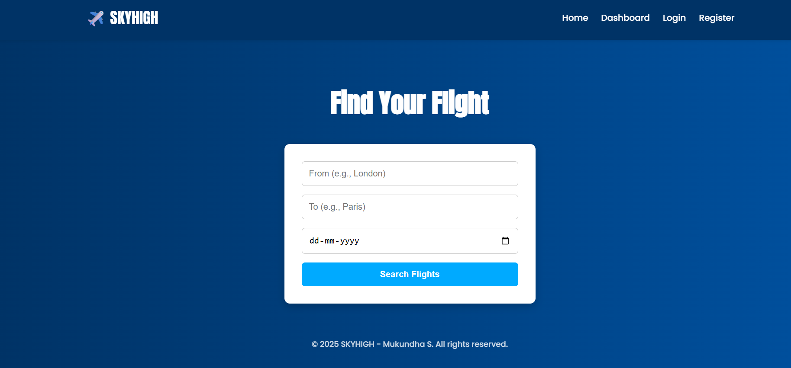
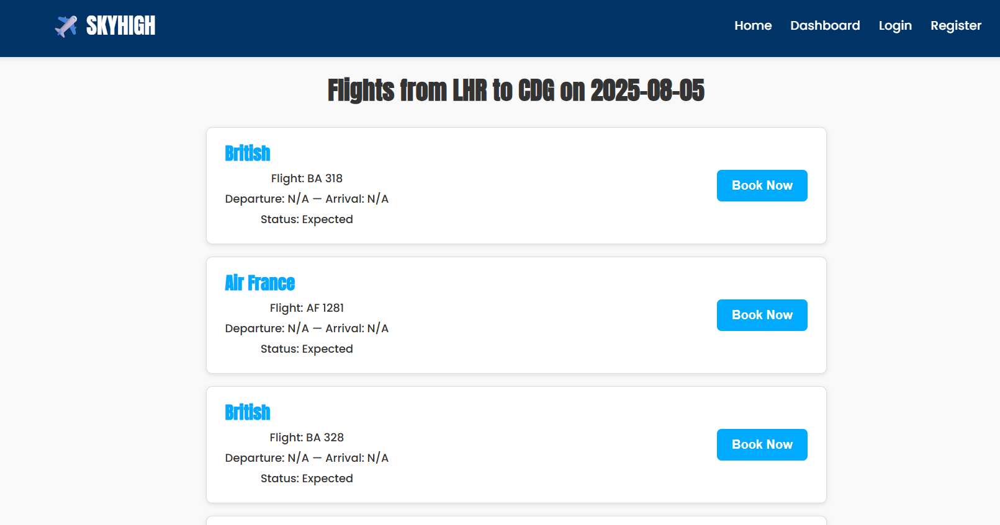

# ✈️ SKYHIGH - Full Stack Flight Booking App

A responsive full-stack web application for real-time flight search and booking. Built with **React**, **Node.js**, **Express**, **MongoDB**, and **RapidAPI**.

---

## 🎥 Demo Video
> 📺 Watch a quick demo of the app:  
> [![Watch Demo]](https://youtu.be/5SRXU4f9ycU)  

---

## 🚀 Live Deployment

| Frontend (React + Vite) | Backend (Node + Express) |
|-------------------------|--------------------------|
| 🌐 [Vercel URL](https://flight-booking-app-full-stack-proje.vercel.app/) | 🛠️ [Render URL](https://flight-booking-app-full-stack-project.onrender.com) |

---

## 🌟 Features

- 🔐 **User Authentication**  
  Register, Login, and Session handling.

- 🔎 **Search Flights in Real-Time**  
  Search using **city names** converted to **IATA codes**. Flight data is fetched from **RapidAPI AviationStack**.

- 🛫 **Book Flights Instantly**  
  User inputs name, email, passport number → booking saved to **MongoDB**.

- 🧾 **Dashboard**  
  Personalized booking dashboard showing all flight bookings by user.

- 📱 **Responsive UI**  
  Built with **custom CSS** & **React Hooks** for smooth user experience.

---

## 🧰 Tech Stack

| Frontend       | Backend               | Database  | External API             |
|----------------|-----------------------|-----------|--------------------------|
| React + Vite   | Node.js + Express.js  | MongoDB   | RapidAPI AviationStack   |

---


---

## ⚙️ Setup Instructions

### 1. Clone the Repository
```bash
git clone https://github.com/your-username/flight-booking-app.git
cd flight-booking-app
```

### 2. Setup Backend
```bash
cd server
npm install
# Create .env file
MONGO_URI=your-mongodb-uri
RAPIDAPI_KEY=your-rapidapi-key
node server.js  # OR nodemon server.js
```

### 3. Setup Frontend
```bash
cd ../client
npm install
# Create .env file
VITE_BACKEND_URL=https://your-backend.onrender.com
npm run dev
```


---

## 🌐 Deployment Overview

- 🔹 Frontend on Vercel → Connect GitHub repo, deploy `client/` folder.
- 🔹 Backend on Render → Set root to `server/`, deploy, and add `MONGO_URI` + `RAPIDAPI_KEY` in environment variables.
- 🔹 RapidAPI (AviationStack) → Fetches real-time flight schedules.

---

## 🔑 Environment Variables
```bash
client/.env
VITE_BACKEND_URL=https://your-backend.onrender.com


server/.env
MONGO_URI=your-mongodb-uri
RAPIDAPI_KEY=your-rapidapi-key
```


---

## 💻 Key Functionalities

| Feature         | Technology Used                    |
|-----------------|-----------------------------------|
| Login/Register  | JWT / Session Auth (localStorage) |
| Search Flights  | React Form + Axios + RapidAPI     |
| Book Flights    | MongoDB + Express API             |
| Dashboard View  | React + Axios (user bookings)     |

---

## 🧪 How to Test

- 📝 Register → Login → Redirect to Dashboard
- 🔍 Search → From and To (valid cities) → Select Date
- 🛫 Click Book → Enter details → Confirm
- 📂 View bookings on Dashboard

---

## 🛠️ Tools Used

- Vercel → Deploy frontend (React)
- Render → Deploy backend (Express server)
- MongoDB Atlas → Cloud-hosted database
- RapidAPI (AviationStack) → Real-time flight API

---

## 📸 Screenshots




---

## 📄 License

This project is open-source under MIT License.  
© 2025 Mukundha S.

---

## 🧑‍💻 Developer Info

Mukundha S.

Email: mukundhasuresh@gmail.com

GitHub: https://github.com/mukundhasuresh


---


